# yyxParkingSimulation
Parking Simulation

Theoretical simulation for learning parking (such as parallel or perpendicular parking)

Implemented by R with grid graphics system

### Prerequisite

R console in Windows and R package {grid}

### Usage

Just load and run parking_simulation.20220109.r in R by
dragging the R script file into R console, or by executing
```source("parking_simulation.20220109.r")``` in R console.

You may manually change the code ```simulation_option = 1``` to ```simulation_option = 2``` for perpendicular parking instead of parallel parking.

Or you may also manually execute ```restart_simulation()``` with different parameters, or even manually change the initial setting in the code of ```restart_simulation()``` (before and defining redraw), for example, change colors, if you like.

### Demo screenshots

- Parallel parking (```simulation_option = 1```):

<p fload="left">
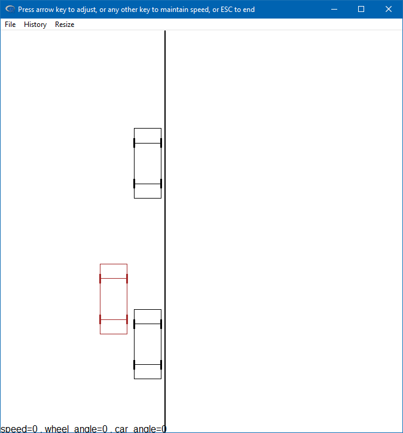
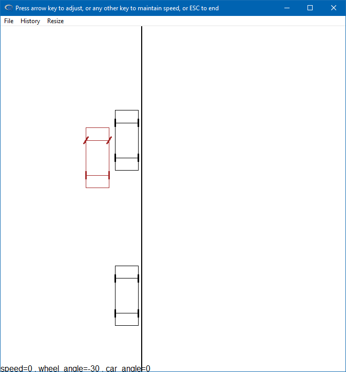
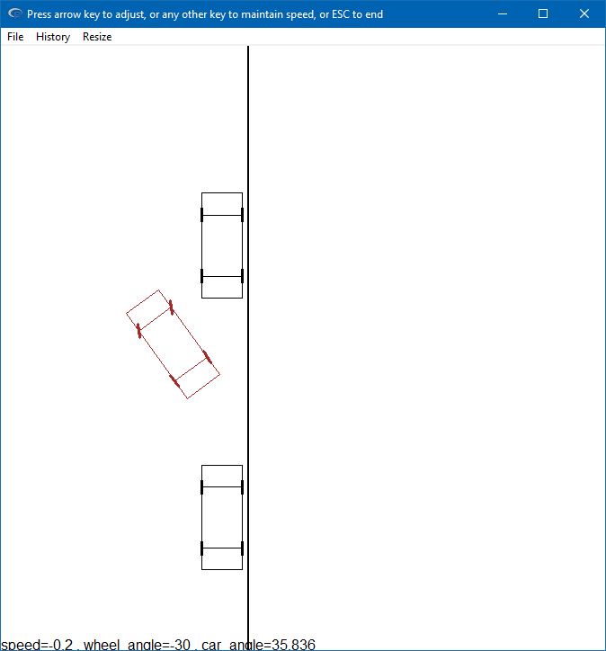
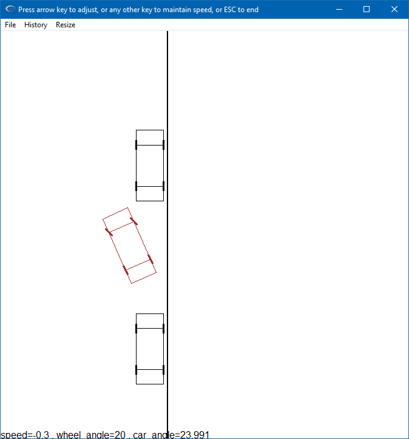
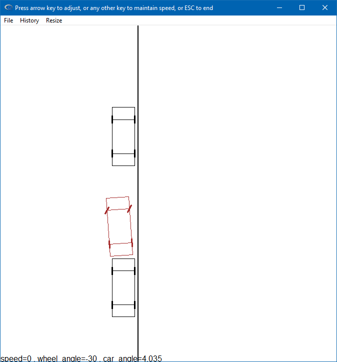
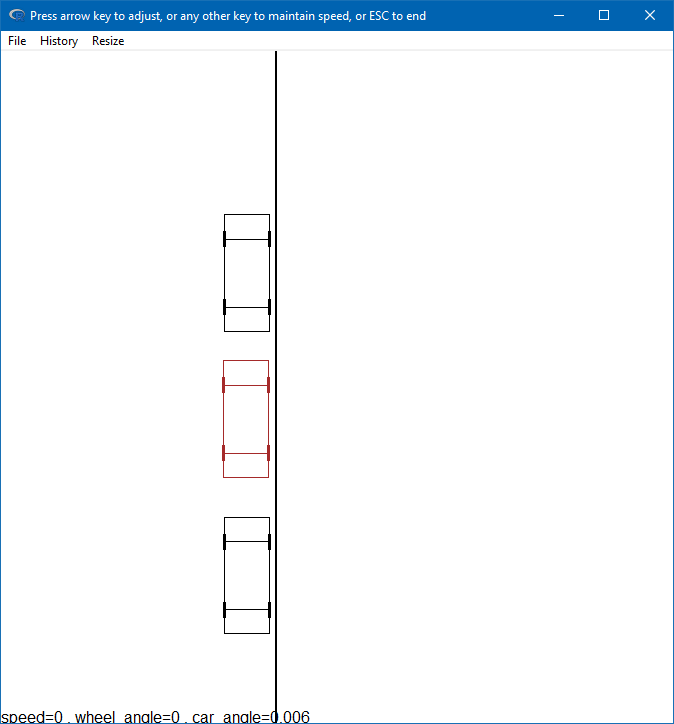
</p>

- Perpendicular parking (```simulation_option = 2```):

<p fload="left">
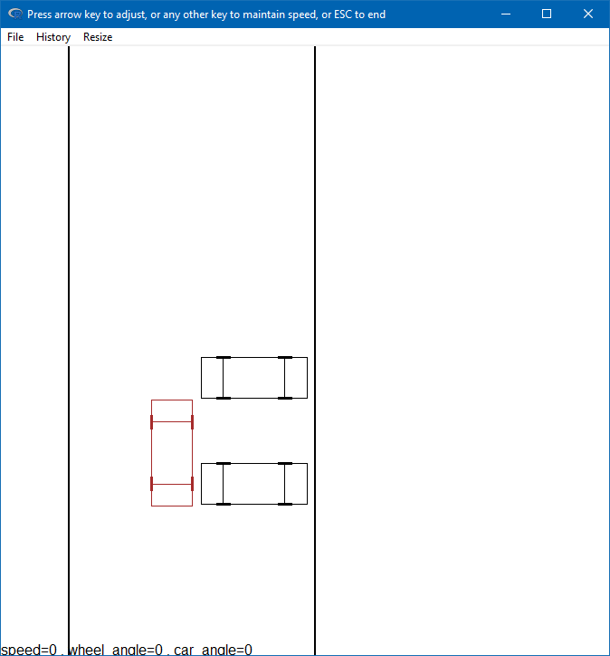
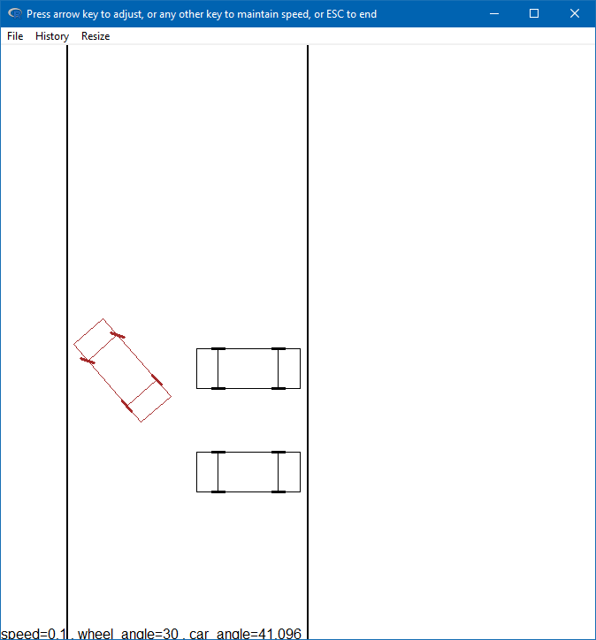
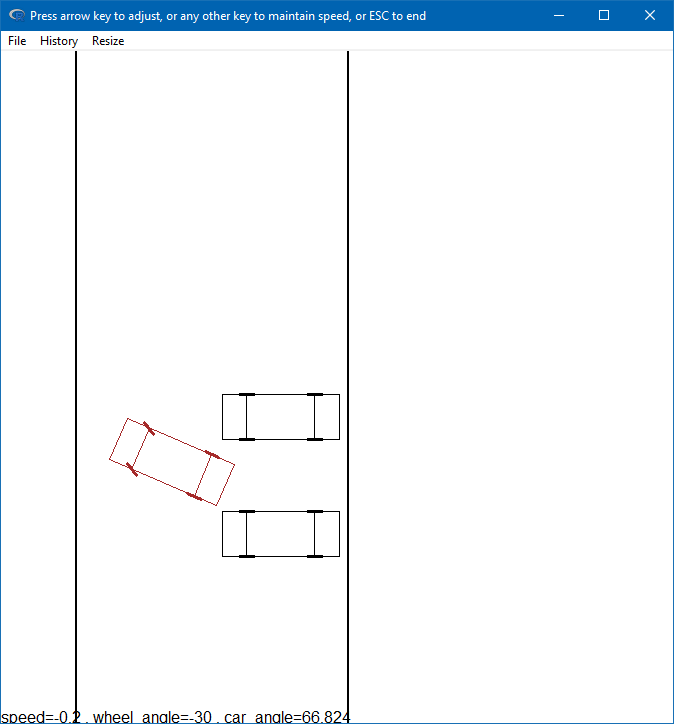
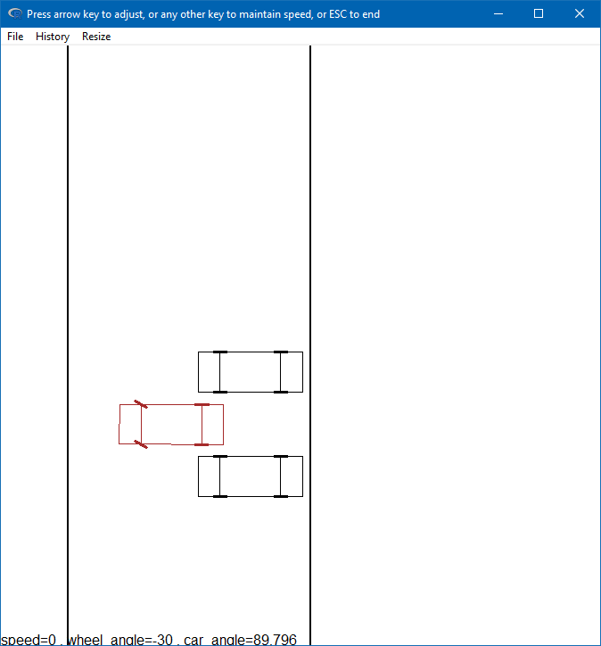
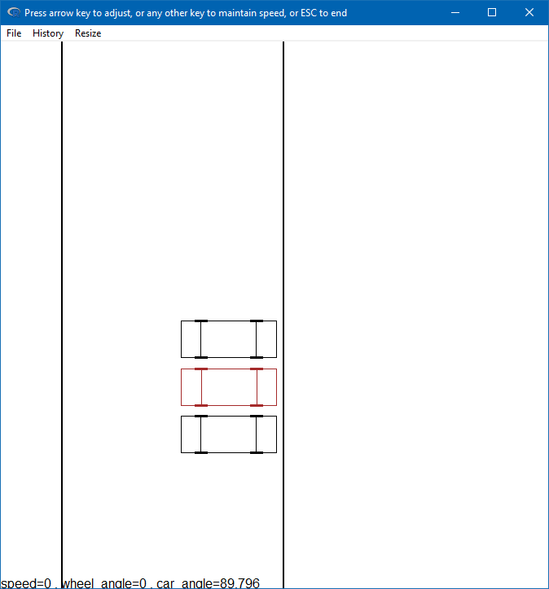
</p>

